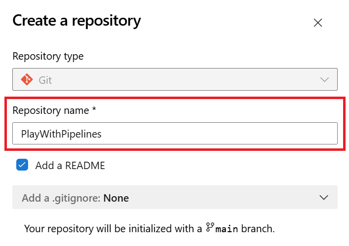
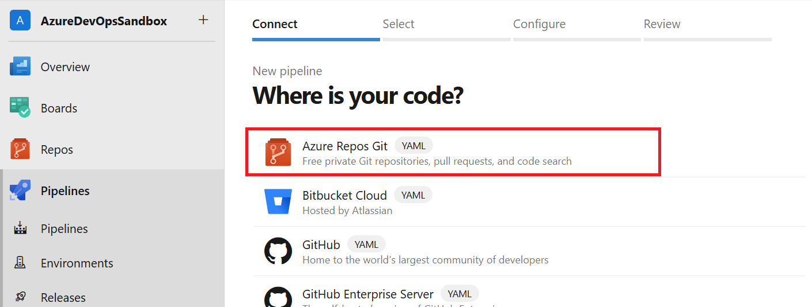
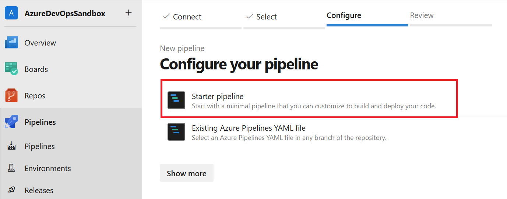
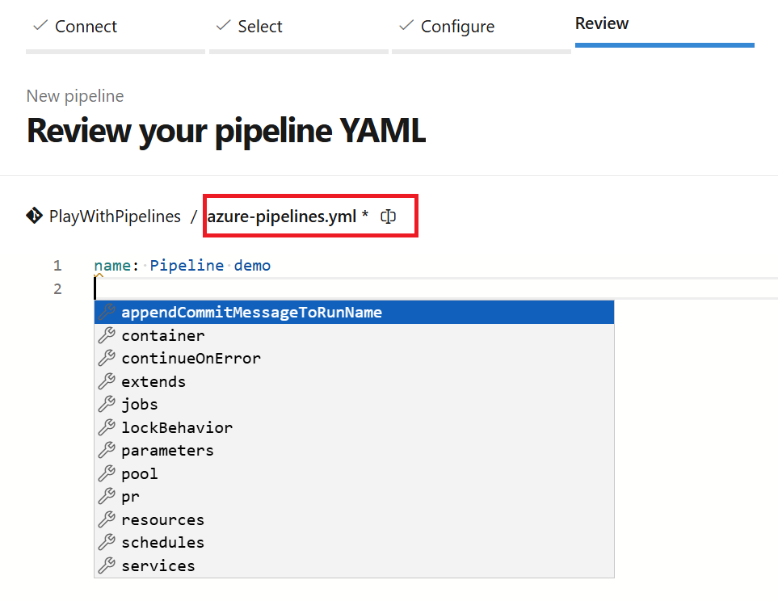
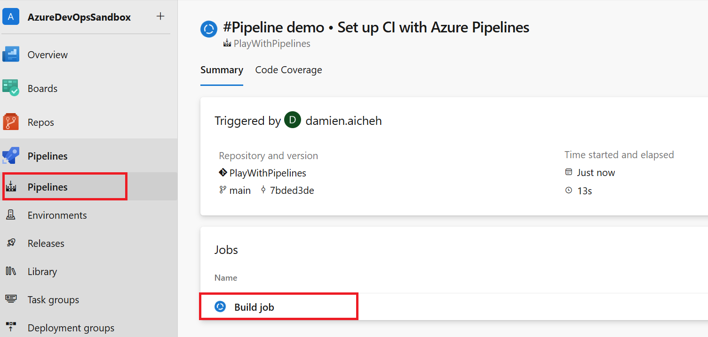
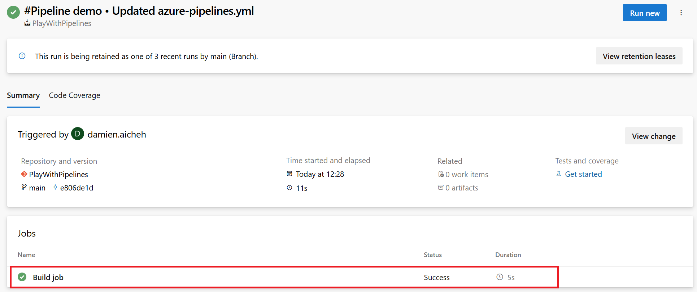
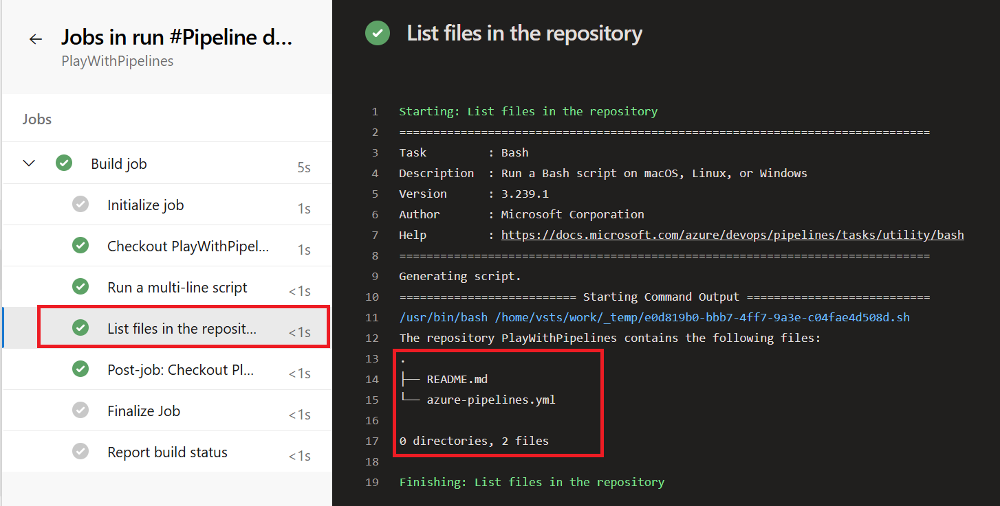

# 🔨 Hands-on: My first pipeline

In this hands-on lab your will create your first Azure DevOps Pipeline and learn how you can use tasks to automate your software development lifecycle. If you like more background information, please refer to the [Azure Pipelines](https://learn.microsoft.com/en-us/azure/devops/pipelines/get-started/key-pipelines-concepts?view=azure-devops) documentation. Good luck! 👍

This hands on lab consists of the following steps:
- [Creating a repository](#creating-a-repository)
- [Creating the pipeline](#creating-the-pipeline)
- [Viewing your pipeline results](#viewing-your-pipeline-results)
- [Skip ci](#skip-ci)

## Creating a repository

Go to your Azure DevOps project and create a new repository:


Name it as you want and click on **Create**



## Creating the pipeline

Go to **Pipelines** and click on **Create Pipeline** and select **Azure Repos Git**:



Then select the repository you just created and click on **Starter pipeline**: 



The file will be named `azure-pipelines.yml` you can rename it if you want.

Remove the template content - we want to create the pipeline from scratch.



Set the pipelione name to `Pipeline demo`:

```YAML
name: Pipeline demo
```

Next, add the triggers to the pipeline with the help of <kbd>Ctrl</kbd>+<kbd>Space</kbd> and the documentation. We want the pipeline to trigger:
  - on every push to the `main` branch, and `features` branches and ignore the `README.md` file
  - on every pull request with `main` as the base branch
  - Every sunday at 6:15 UTC

<details>
  <summary>Solution</summary>

```YAML
trigger:
  branches:
    include:
      - main
      - features/*
  paths:
    exclude:
      - README.md

schedules:
- cron: '15 6 * * 0'
  displayName: Every sunday at 6:15 UTC
  branches:
    include:
    - main
```

</details>

Create a job `Build` that runs on the latest Ubuntu image on Azure DevOps hosted agents. The job should do the following things:
  - Output the name of the event that triggered the pipeline
  - Output the name of the branch that the repository is currently referencing
  - List all files in the repository
  - Try to use both the `script` and `Bash@3` task to run the commands.

Use the predefined variables [available](https://learn.microsoft.com/en-us/azure/devops/pipelines/build/variables?view=azure-devops&tabs=yaml).

<details>
  <summary>Solution</summary>

```YAML
jobs:
- job: Build
  displayName: 'Build job'
  pool:
    vmImage: 'ubuntu-latest'
  steps:
  - script: |
      echo "🎉 The job started by: $(Build.Reason)"
      echo "🔎 The name of your branch is $(Build.SourceBranchName)."
    displayName: 'Run a multi-line script'
  
  - task: Bash@3
    displayName: List files in the repository
    inputs: 
      targetType: 'inline'
      script: |
        echo "The repository $(Build.Repository.Name) contains the following files:"
        tree
```

script and Bash@3 task are equivalent, but by using `Bash@3` you force the script to run in a bash shell.

</details>

Save and run the pipeline by commiting the file. You will be automatically redirected to the pipeline run:



## Viewing your pipeline results

Click on your pipeline run, on the job `Build`:



Expand `Build job` and note the log in the Checkout task added automatically with the line number (line numbers are links). Check the informations about the build:


Expand your jobs and check that the output was correct.




## Skip ci

Modify something in your pipeline and add `[skip ci]` (not triggering the pipeline) in a commit:


All the possible notations are in this [documentation](https://learn.microsoft.com/en-us/azure/devops/pipelines/repos/azure-repos-git?view=azure-devops&tabs=yaml#skipping-ci-for-individual-pushes).

You should see that no pipeline is triggered.

## Summary

In this hands-on you've learned to create you first pipelines with triggers, jobs, steps, and expressions.