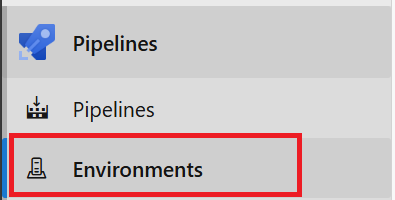
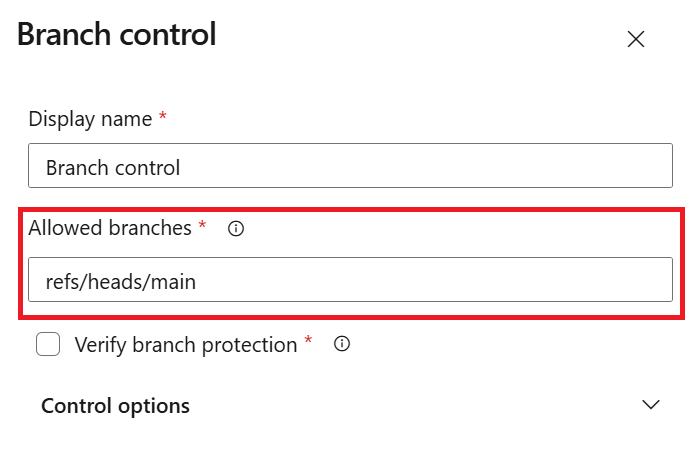
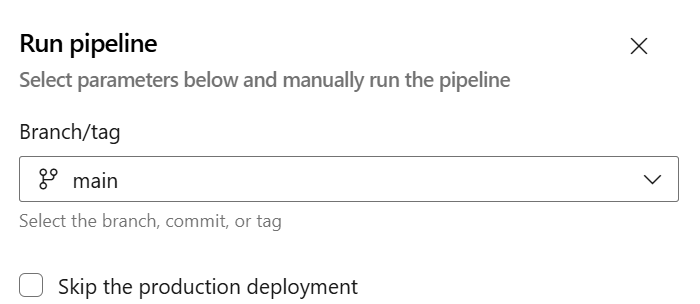
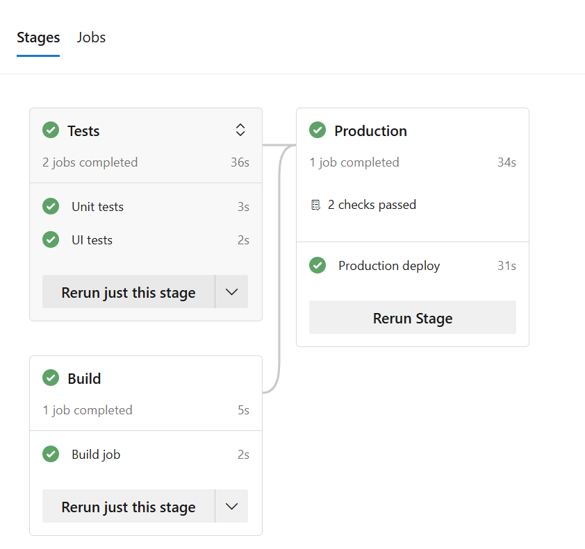

# 🔨 Hands-on: Staged deployments

In this hands-on lab your will a staged deployment pipelines with approvals.

## Creating and protecting environments

Go to the Environments section :



Create 1 environment called `Production` and select the **None** option:


You should see the environments created, click on the `Production` environment and go to the `Approvals and checks` tab. On the right side, click on the `+` button. Search for **Approvals** and click **Next**.

Add yourself as the `Required approvals` for this environment:


Click on **Create** 

Click again on the `+` button and search for **Branch control** and set the `Branch name` to `main`:



This will ensure that only deployments from the `main` branch will be allowed to the `Production` environment.

You now have a protected environment that requires your approval before deploying:


## Adding an input for picking environments to manual pipeline trigger

Modify the pipeline yaml file you created in hands on lab 1 ('My first pipeline').
Add an input of the type `boolean` to the `parameters` just before the job section that you created previously. This will allows you to skip the production deployment that you will create just after. 

All the parameters types are available in the [documentation](https://learn.microsoft.com/en-us/azure/devops/pipelines/process/runtime-parameters?view=azure-devops&tabs=script#parameter-data-types)

<details>
<summary>Solution</summary>

```YAML
parameters:
- name: skipProductionDeployment
  displayName: 'Skip the production deployment'
  type: boolean
  default: true
```

</details>

## Chaining pipelines steps and conditional execution

Now update the pipeline file to have 3 stages :
  - Tests: runs on `ubuntu-latest` in parallel of the `Build` one. This one will have 2 jobs one to simulate `Unit tests` and another one for `UI tests`.
  - Build: Update the job to wrap it inside a stage and make sure it runs in parallel of the Tests stage. 
  - Production: runs on `ubuntu-latest` after `Tests` and `Build`. Deploys to the environment `Production` only if this was selected as the input parameter. To simulate deployment, the job will execute 3 steps. Each step with writes `Step x deploying...` to the pipeline log and sleeps for 10 seconds.

<details>
<summary>Solution</summary>

```YAML
stages:
- stage: Tests
  jobs:
  - job: 
    displayName: Unit tests
    steps:
      - script: echo simulate running your unit tests!
        displayName: 'Run unit tests'
  - job: 
    displayName: UI tests
    steps:
      - script: echo "🧪 Testing..."
        displayName: 'UI Test'

- stage: Build
  dependsOn: [] # This will remove implicit dependency and run in parallel with the stage: Tests above 
  jobs:
  - job: Build
    displayName: 'Build job'
    pool:
      vmImage: 'ubuntu-latest'
    steps:
    - script: |
        echo "🎉 The job started by: $(Build.Reason)"
        echo "🔎 The name of your branch is $(Build.SourceBranchName)."
      displayName: 'Run a multi-line script'

- stage: Production
  condition: ${{ ne(parameters.skipProductionDeployment, true) }}
  dependsOn:
  - Tests
  - Build
  jobs:
  - deployment:
    displayName: Production deploy
    environment: Production
    strategy:
     runOnce:
       deploy:
         steps:
          - script: |
              echo "🚀 Step 1..."
              sleep 10
            displayName: 'Step 1'
          - script: |
              echo "🚀 Step 2..."
              sleep 10
            displayName: 'Step 2'
          - script: |
              echo "🚀 Step 3..."
              sleep 10
            displayName: 'Step 3'
```

</details>

Let's run the pipeline manually:



You can skip the production deployment by checking or not the checkbox directly.

Then at first launch, you will see a section to review the permissions to access the `Production` environment first. Approve this environment and when you will arrive to the production stage if you haven't skip it you will receive a notification to approve it or not:


Open it and click **Approve**

The pipeline stop until you accept or not the deployment or hit the time out limit specified in the environment at the begining, this will automatically cancel the pipeline:


If you accept the deployment you should see something like this:



## Summary

In this lab you have learned to create and protect environments in Azure DevOps and use them in a pipeline. You have also learned to conditionally
execute jobs in parallel to chain jobs using the `dependsOn` keyword.